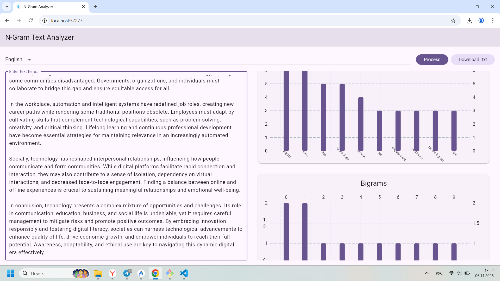

# 📜 N-Gram Text Analyzer

A web-based text analysis tool built with **Flutter Web**. It allows users to perform **word frequency** and **N-gram analysis** (bigrams, trigrams) on input text. The project follows a clean **MVC architecture** and features a minimalistic design inspired by **Material Design 3**.

---

## ⚙️ Features

- **Text input** with multi-line support.
- **Stop-word filtering** for multiple languages (English, Russian, Turkish).
- **N-gram analysis**: word frequency, bigrams, and trigrams.
- **Interactive bar charts** using `fl_chart`.
- **Download results** as a `.txt` file.
- **Responsive design** for web.

---

## 📸 Demo

  

---

## 🤺 Usage

- Enter or paste text into the left panel.

- Select the language for stop-word filtering (EN, RU, TR).

- Click Process to analyze text.

- View word frequency, bigrams, and trigrams in interactive charts.

- Click Download .txt to save results locally.

---

## 🔗 Dependencies

Dependencies

- [Flutter](https://flutter.dev/)

- [fl_chart](https://pub.dev/packages/fl_chart)
 – for chart visualization